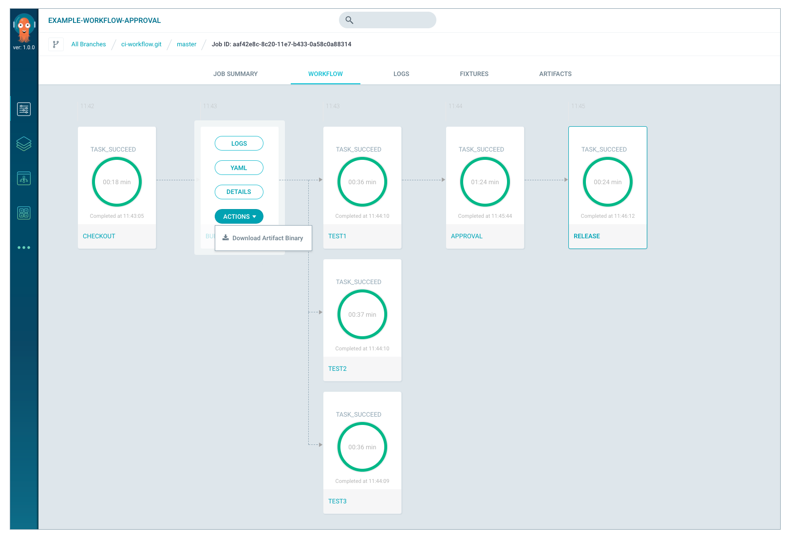

# Tutorial 1: Run a CI Workflow

This tutorial shows you how to run a container-native, CI workflow on Kubernetes using the Argo workflow engine. An Argo Workflow consists of steps and every step runs as a container within a Kubernetes pod. These are the steps you'll run in the sample CI workflow:

* Checkout code
* Build the code
* Run multiple tests in parallel
* Send an approval email
* Release the binary

## Prerequisites
This tutorial assumes the following:

* You have successfully [installed Argo](https://argoproj.github.io/argo-site/get-started/installation).
* You have integrated Argo with the sample CI workflow repo at [https://github.com/argoproj/ci-workflow](https://github.com/argoproj/ci-workflow)
<!--* You have logged into the Argo command line. From your terminal, cd to the directory where enter the following information:

Calvins-MacBook-Pro:~ cyee$ ~/Downloads/argo login
Enter a configuration name (default): calvinconfig
Enter cluster URL: https://dev.applatix.net
Enter cluster username: calvin@applatix.com    
Enter cluster password:
Config written to: /Users/cyee/.argo/calvinconfig  -->

## About the YAML Files

The CI workflow uses 4 YAML files from the repo at  [https://github.com/argoproj/ci-workflow/.argo](https://github.com/argoproj/ci-workflow):

* `example-workflow-approval.yaml` - defines the CI workflow
* `argo-checkout.yaml` - defines a container that Argo provides for checking out code from your repo to an AWS S3 bucket that your workflow steps can access.
* `argoapproval.yaml` - defines a container that Argo provides for sending email for approval.
* `example-build.yaml` -  specifies a Go container to perform a golang build.

## Run Argo Sample CI Workflow
<!--add cli command here - code block-->

1. Go to the **Catalog** menu in the Argo Web UI, select **CI Workflow**  and click **Run**.
1. For the workflow parameter called **REQUIRED_APPROVALS**, enter your email address as the approver--this is a mandatory input parameter for the approval step.
1. Click **Submit**.
1. When you receive the approval email, click **Approve**.

You can see the workflow status in the Argo Web UI. You can also check the logs and artifacts generated by each step:



<!--This is the CLI output:
```
$ ~/argo job submit example-workflow-approval --argument "parameters.COMMIT=7748dc80185d35347ba879ae61363d41c6edac95" --argument "parameters.REPO=https://github.com/argoproj/ci-workflow.git" --argument "parameters.REQUIRED_APPROVALS=calvin@applatix.com" --repo https://github.com/argoproj/ci-workflow.git --config calvinconfig
Submitting template example-workflow-approval (ID: 3c5e4108-8711-5185-699a-c89ea2b9ebab, repo: https://github.com/argoproj/ci-workflow.git, branch: master)
ID:               6612ee7c-97fb-11e7-b265-0a58c0a88206
URL:              https://dev.applatix.net/app/timeline/jobs/6612ee7c-97fb-11e7-b265-0a58c0a88206
Name:             example-workflow-approval
Status:           Init
Submitter:        calvin@applatix.com
Submitted:        Tue Sep 12 13:46:06 -0700 (1 second ago)
Duration:         0 seconds
Template:         example-workflow-approval
Arguments:        
 parameters.COMMIT:              7748dc80185d35347ba879ae61363d41c6edac95
  parameters.REPO:                https://github.com/argoproj/ci-workflow.git
  parameters.REQUIRED_APPROVALS:  calvin@applatix.com
Calvins-MacBook-Pro:.argo cyee$
```-->

## Customize Your CI Workflow

1. In your own repo, create a directory called `.argo`. (The Argo Workflow engine uses this directory to look for the YAML files to run for a containerized workflow.)
1. Copy the YAML templates you ran in the sample CI workflow from [https://github.com/argoproj/ci-workflow/.argo](https://github.com/argoproj/ci-workflow/tree/master/.argo) to the `.argo` folder you just created in your repo.
1. Customize the `example-workflow-approval.yaml` file by writing your own build, test, and release containers.
	For more details about writing the YAML DSL see [Argo YAML DSL Reference](./../yaml/dsl_reference_intro.md).
1. 	Integrate your repo with Argo. In Argo Web UI, select **Administration->Integrations->SCM**. Once integrated, the Argo Web UI will display your source code commits in the **Timeline** menu item.


## Run Your Custom CI Workflow


 You have two options for running your customized CI workflow:

 * **Manually**

mention you can run it from CLI
	1. Go to **Timeline** menu, select a commit and click **Create a New Job**.
	1. Select the CI workflow name, enter values for the input parameters and click **Submit**.  
<br/>
   (Optional) If you want your CI-Workflow to show up in your Catalog menu, just copy the `example-approval-project.yaml` file into the `.argo` directory in your repo. This YAML file defines how to add a CI workflow item in your Catalog.


* **Automatically**

	1. Copy the `example-policy.yaml` file to the `.argo` directory in your repo and modify it as needed.
	1. Enable your policy template. (**Templates** > *name_of_policy_template* > and click **Enabled**)  
   <br/> After you've completed these steps, every time you make a commit in your repo, the CI workflow is automatically triggered.
