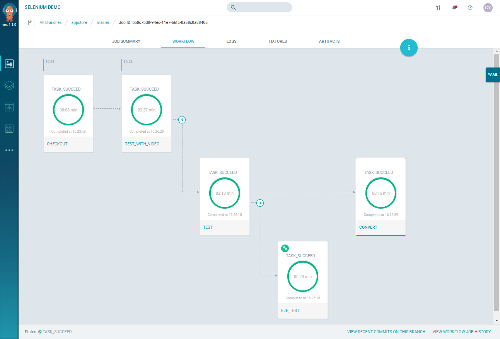

# Tutorial 6: Running Nested Workflows

This tutorial shows how to use nested workflows to:

*   run a Selenium test against a web application ("Hello World") that runs in two web browsers (Chrome and Firefox)
*   record and output a video of screenshots taken during the test

In this tutorial, you'll run multiple steps, which are grouped into nested workflows.

## Prerequisites

  This tutorial assumes the following:

  * You have successfully [installed Argo](https://argoproj.github.io/argo-site/get-started/installation).
  * You have integrated Argo with the sample Selenium test repo at [https://github.com/argoproj/appstore/](https://github.com/argoproj/appstore/)

## About the YAML Files

The Selenium test workflow uses 3 YAML files from the ``.argo` directory of the repo at  [https://github.com/argoproj/appstore/](https://github.com/argoproj/appstore/):

* `argo-checkout.yaml` - creates a container for checking out source code from the repo.
* `selenium_all_ax.yaml` - has several workflows that are nested in this order:
    * top level workflow: `Selenium Demo`, which has these steps:
     * Checks out code from repo for the Selenium app (`argo-checkout`)
     * Runs the nested workflow for performing the Selenium test and video conversion (`selenium-with-video-converter-workflow`)
    * 1st nested workflow: `selenium-with-video-converter`, which has these steps:
     * Runs the nested workflow (`selenium-test-workflow`) that performs the Selenium test of the app.
     * Runs the container (`video-converter`) that performs the video conversion
    * 2nd nested workflow: `selenium-test-workflow`, which has these steps and specifications:
     * Runs the end-to-end Selenium test (`selenium-e2e-test`)

       NOTE: This step creates a container that runs the test, declares [managed fixtures](./../user_guide/infrastructure/using_fixtures.md) for the Selenium server, the web app to test in the browsers, and video recorder, and issues the commands to run the test (`selenium-server`, `selenium-test-app`, and `vnc-recorder`).
* `selenium_video_tool.yaml` - defines the containers for recording and converting the video of the Selenium test from `.flv` format to `.mp4` format (`vnc-recorder` and `video-converter`).

NOTE: Every step in a workflow needs to be defined as a container specification and creates a Kubernetes job. For more details on the workflow and container YAML DSL please check the YAML tutorial at [Container Template](./../yaml/container_templates.md).

## Run Workflow for Selenium Test

1. In the Argo Web UI, select **Catalog** > **Demo** > **Selenium testing** and click **TEST**.
1. Click **Submit** to start the job with nested workflows.

  You will see the workflow running in Argo Web UI where every step is a container. You can check the log and artifact generated by clicking on each step.

  

## Viewing the Test Outputs and Artifacts

To view the video output of the Selenium test, go to the specific Job, click **Workflow**, hover your mouse over a container, click **ACTIONS** and select **Download artifact VIDEO** or **Browse artifact VIDEO**.

To view a report of the test, go to the **E2E_TEST** container and click **Download artifact REPORT**.

## Viewing Information for a Test Failure

To view a report of the test failure,  go to the specific Job, click **Workflow**, hover your mouse over the container with a "red" circle, click **ACTIONS**, and select **Browse artifact REPORT**. A dialog opens displaying the results and highlighting the lines that failed.

## Customize Your YAML Files

1. In your own repo, create a directory called `.argo`. (The Argo Workflow engine uses this directory to look for the YAML files to run for a containerized workflow.)
1. Copy the YAML templates you ran in the sample workflow from the `.argo` directory in  [https://github.com/argoproj/appstore/](https://github.com/argoproj/appstore/) to the `.argo` folder you just created in your repo.
1. Customize the `selenium_all_ax.yaml` file by specifying your own app to test or adding more steps.

	For more details about writing the YAML DSL, see [Argo YAML DSL Reference](./../yaml/dsl_reference_intro.md).

After you integrate your repo with Argo, the Argo Web UI will display your source code commits in the **Timeline** menu item.

## Running Your Customized Selenium Test Workflow

You have two options for running your customized DinD build workflow:

 * **Manually**

	1. Go to **Timeline** menu, select a commit and click **Create a New Job**.
	1. Select the YAML templates to create a job, click **NEXT**, enter values for the input parameters and click **Submit**.

    (Optional) If you want to let users run the project from the **Catalog** menu, just copy the `selenium_test_project.yaml` file into the `.argo` directory of your repo. and modify it. If you do not want to provide this option, then users can run the workflow against your commits displayed in the **Timelines** menu. You can also run all your YAML templates from the **Templates** menu.

 * **Automatically**
  	1. Add `commit` and `repo` as input parameters to your workflow as shown in [Tutorial 1](./argo_tutorial_1_create_ci_workflow.md).
  	2. Create and activate a Policy template to trigger this workflow for every commit as shown in [Tutorial 1](./argo_tutorial_1_create_ci_workflow.md).

     After you've completed these steps, every time you make a commit in your repo, the Selenium test workflow is automatically triggered.   
